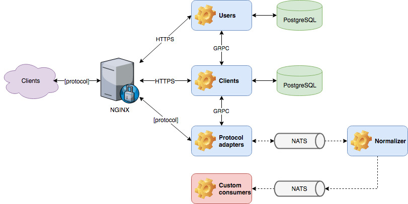

## Components

Mainflux IoT platform is comprised of the following services:

| Service                                                                   | Description                                                             |
|:--------------------------------------------------------------------------|:------------------------------------------------------------------------|
| [users](https://github.com/mainflux/mainflux/tree/master/users)           | Manages platform's users and auth concerns                              |
| [things](https://github.com/mainflux/mainflux/tree/master/things)         | Manages platform's things, channels and access policies                 |
| [normalizer](https://github.com/mainflux/mainflux/tree/master/normalizer) | Normalizes SenML messages and generates the "processed" messages stream |
| [http-adapter](https://github.com/mainflux/mainflux/tree/master/http)     | Provides an HTTP interface for accessing communication channels         |
| [ws-adapter](https://github.com/mainflux/mainflux/tree/master/ws)         | Provides a WebSocket interface for accessing communication channels     |
| [mqtt-adapter](https://github.com/mainflux/mainflux/tree/master/mqtt)     | Provides an MQTT interface for accessing communication channels         |
 | [coap-adapter](https://github.com/mainflux/mainflux/tree/master/coap)         | Provides a CoAP interface for accessing communication channels     |
 | [lora-adapter](https://github.com/mainflux/mainflux/tree/master/lora)         | Provides a LoRa Server forwarder for accessing communication channels    |
 | [mainflux-cli](https://github.com/mainflux/mainflux/tree/master/cli)         | Command line interface     |

## Domain model

The platform is built around 3 main entities: **users**, **things** and **channels**.

`User` represents the real (human) user of the system. It is represented via its
e-mail and password, which he uses as platform access credentials in order to obtain
an access token. Once logged into the system, user can manage his resources (i.e.
things and channels) in CRUD fashion, and define access control policies by
connecting them.

`Thing` represents devices and applications connected to Mainflux. There are
two types of "things" supported at the moment: `device` and `app`. While device
is used to represent any physical device connected to the platform, app represents
any 3rd party service that uses the platform for message exchange with other
"things". 

`Channel` represents a communication channel. It serves as message topic that
can be consumed by all of the things connected to it.

## Messaging

Mainflux uses [NATS](https://nats.io) as its messaging backbone, due to its
lightweight and performant nature. You can treat its *subjects* as physical
representation of Mainflux channels, where subject name is constructed using
channel unique identifier.

In general, there is no constrained put on content that is being exchanged
through channels. However, in order to be post-processed and normalized,
messages should be formatted using [SenML](https://tools.ietf.org/html/draft-ietf-core-senml-08).
