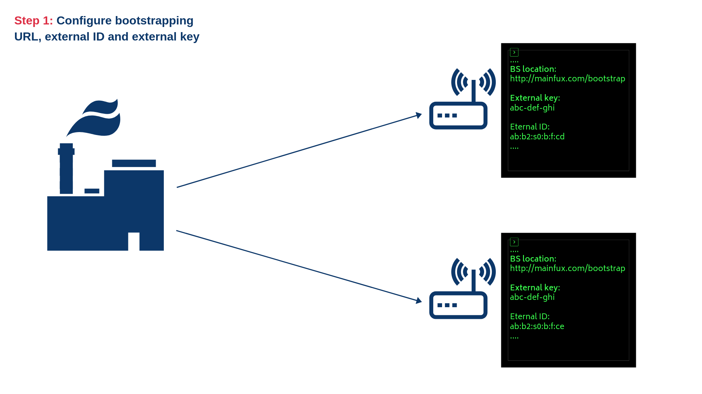
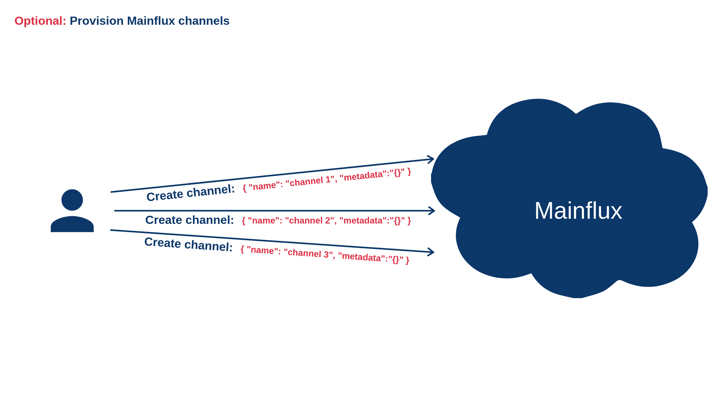
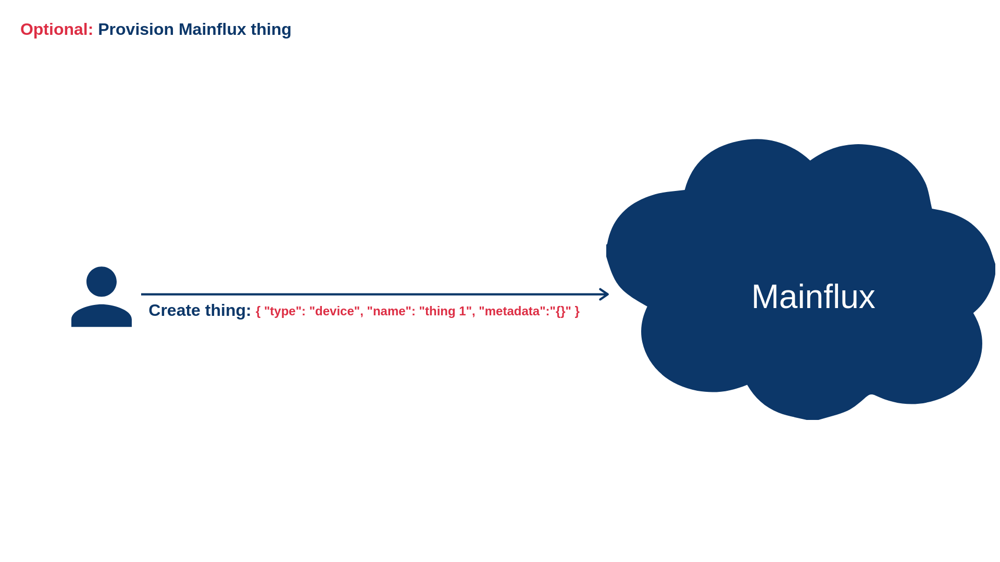
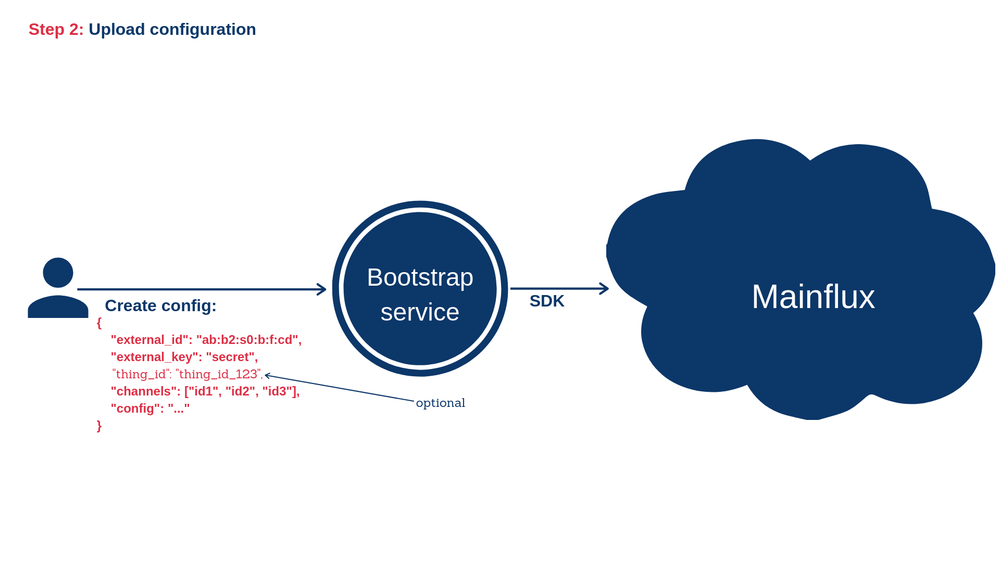
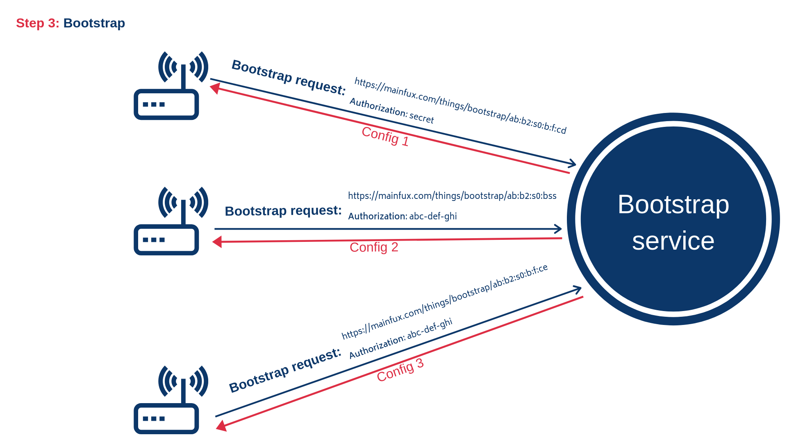
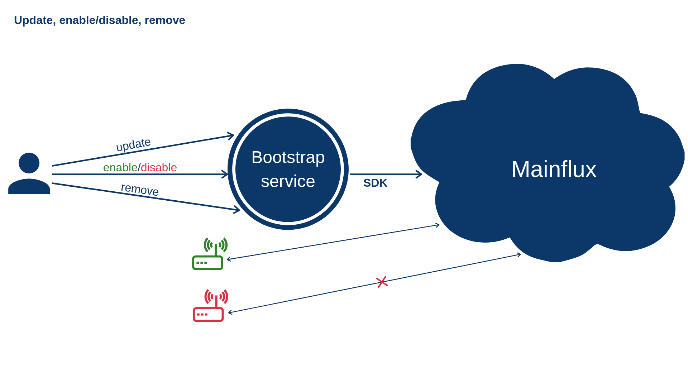

## Bootstrap

`Bootstrapping` refers to a self-starting process that is supposed to proceed without external input.
Mainflux platform supports bootstrapping process, but some of the preconditions need to be fulfilled in advance. The device can trigger a bootstrap when:s

- device contains only bootstrap credentials and no Mainflux credentials
- device, for any reason, fails to start a communication with the configured Mainflux services (server not responding, authentication failure, etc..).
- device, for any reason, wants to update its configuration

> Bootstrapping and provisioning are two different procedures. Provisioning refers to entities management while bootstrapping is related to entity configuration.

Bootstrapping procedure is the following:


*1) Configure device with Bootstrap service URL, an external key and external ID*

> 
*Optionally create Mainflux channels if they don't exist*

> 
*Optionally create Mainflux thing if it doesn't exist*


*2) Upload configuration for the Mainflux thing*


*3) Bootstrap - send a request for the configuration*


*4) Connect/disconnect thing from channels, update or remove configuration*

### Configuration

The configuration of Mainflux thing consists of three major parts:

- The list of Mainflux channels the thing is connected to
- Custom configuration related to the specific thing
- Thing key and certificate data related to that thing

Also, the configuration contains an external ID and external key, which will be explained later.
In order to enable the thing to start bootstrapping process, the user needs to upload a valid configuration for that specific thing. This can be done using the following HTTP request:

```bash
curl -s -S -i -X POST -H "Authorization: <user_token>" -H "Content-Type: application/json" http://localhost:8200/things/configs -d '{
        "external_id":"09:6:0:sb:sa",
        "thing_id": "1b9b8fae-9035-4969-a240-7fe5bdc0ed28",
        "external_key":"key",
        "name":"some",
        "channels":[
                "c3642289-501d-4974-82f2-ecccc71b2d83",
                "cd4ce940-9173-43e3-86f7-f788e055eb14",
                "ff13ca9c-7322-4c28-a25c-4fe5c7b753fc",
                "c3642289-501d-4974-82f2-ecccc71b2d82"
],
        "content": "config...",
        "client_cert": "PEM cert",
        "client_key": "PEM client cert key",
        "ca_cert": "PEM CA cert"
}'
```

In this example, `channels` field represents the list of Mainflux channel IDs the thing is connected to. These channels need to be provisioned before the configuration is uploaded. Field `content` represents custom configuration. This custom configuration contains parameters that can be used to set up the thing. It can also be empty if no additional set up is needed. Field `name` is human readable name and `thing_id` is an ID of the Mainflux thing. This field is not required. If `thing_id` is empty, corresponding Mainflux thing will be created implicitly and its ID will be sent as a part of `Location` header of the response. Fields `client_cert`, `client_key`, and `ca_cert` represent PEM or base64-encoded DER client certificate, client certificate key, and trusted CA, respectively.

There are two more fields: `external_id` and `external_key`. External ID represents an ID of the device that corresponds to the given thing. For example, this can be a MAC address or the serial number of the device. The external key represents the device key. This is the secret key that's safely stored on the device and it is used to authorize the thing during the bootstrapping process. Please note that external ID and external key and Mainflux ID and Mainflux key are _completely different concepts_. External id and key are only used to authenticate a device that corresponds to the specific Mainflux thing during the bootstrapping procedure. As Configuration optionally contains client certificate and issuing CA, it's possible that device is not able to establish TLS encrypted communication with Mainflux before bootstrapping. For that purpose, Bootstrap service exposes endpoint used for secure bootstrapping which can be used regardless of protocol (HTTP or HTTPS). Both device and Bootstrap service use a secret key to encrypt the content. Encryption is done as follows:

   1) Device uses the secret encryption key to encrypt the value of that exact external key
   2) Device sends a bootstrap request using the value from 1 as an Authorization header
   3) Bootstrap service fetches config by its external ID
   4) Bootstrap service uses the secret encryption key to decrypt Authorization header
   5) Bootstrap service compares value from 4 with the external key of the config from 3 and proceeds to 6 if they're equal
   6) Bootstrap service uses the secret encryption key to encrypt the content of the bootstrap response

> Please have on mind that secret key is passed to the Bootstrap service as an environment variable. As security measurement, Bootstrap service removes this variable once it reads it on startup. However, depending on your deployment, this variable can still be visible as a part of your configuration or terminal emulator environment.

For more details on which encryption mechanisms are used, please take a look at the implementation.

### Bootstrapping

Currently, the bootstrapping procedure is executed over the HTTP protocol. Bootstrapping is nothing else but fetching and applying the configuration that corresponds to the given Mainflux thing. In order to fetch the configuration, _the thing_ needs to send a bootstrapping request:

```bash
curl -s -S -i -H "Authorization: <external_key>" http://localhost:8200/things/bootstrap/<external_id>
```

The response body should look something like:

```json
{
   "mainflux_id":"7c9df5eb-d06b-4402-8c1a-df476e4394c8",
   "mainflux_key":"86a4f870-eba4-46a0-bef9-d94db2b64392",
   "mainflux_channels":[
      {
         "id":"ff13ca9c-7322-4c28-a25c-4fe5c7b753fc",
         "name":"some channel",
         "metadata":{
            "operation":"someop",
            "type":"metadata"
         }
      },
      {
         "id":"925461e6-edfb-4755-9242-8a57199b90a5",
         "name":"channel1",
         "metadata":{
            "type":"control"
         }
      }
   ],
   "content":"config..."
}
```

The response consists of an ID and key of the Mainflux thing, the list of channels and custom configuration (`content` field). The list of channels contains not just channel IDs, but the additional Mainflux channel data (`name` and `metadata` fields), as well.

### Enabling and disabling things

Uploading configuration does not automatically connect thing to the given list of channels. In order to connect the thing to the channels, user needs to send the following HTTP request:

```bash
curl -s -S -i -X PUT -H "Authorization: <user_token>" -H "Content-Type: application/json" http://localhost:8200/things/state/<thing_id> -d '{"state": 1}'
```

In order to disconnect, the same request should be sent with the value of `state` set to 0.

For more information about Bootstrap API, please check out the [API documentation](https://github.com/mainflux/mainflux/blob/master/bootstrap/swagger.yml).
