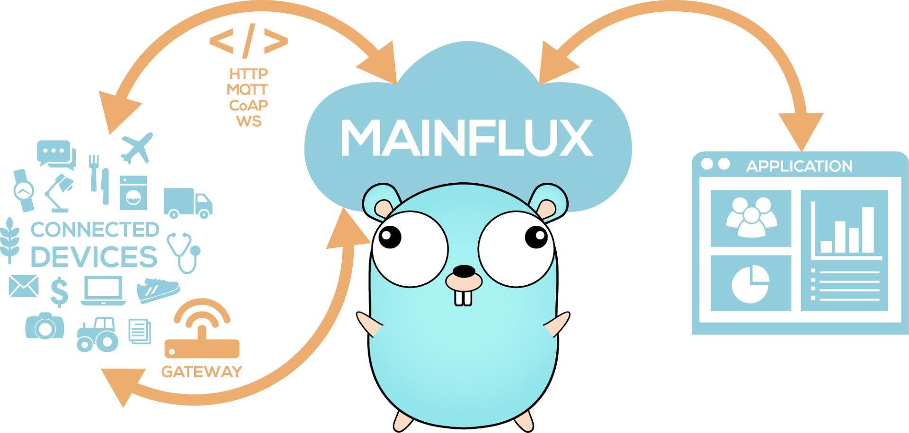

## What is Mainflux?

Mainflux is modern, scalable, secure open source and patent-free IoT cloud platform written in Go.

It accepts user, device, and application connections over various network protocols (i.e. HTTP,
MQTT, WebSocket, CoAP), thus making a seamless bridge between them. It is used as the IoT middleware
for building complex IoT solutions.

## Features

- Protocol bridging (i.e. HTTP, MQTT, WebSocket, CoAP)
- Device management and provisioning
- Fine-grained access control
- Platform logging and instrumentation support
- Container-based deployment using Docker
