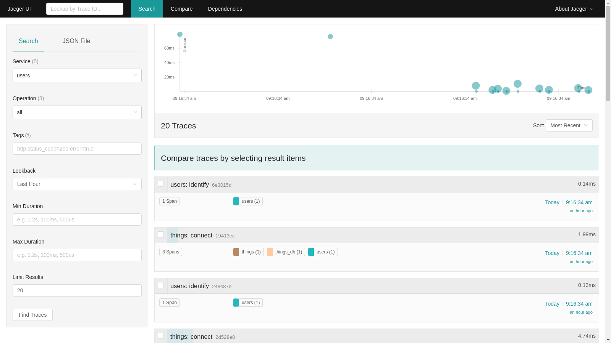
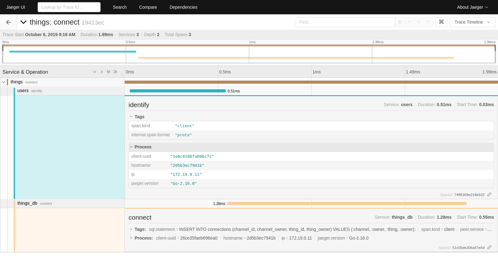

# Tracing

Distributed tracing is a method of profiling and monitoring applications.  It can provide valuable insight when optimizing and debugging an application.  Mainflux includes the [Jaeger](https://www.jaegertracing.io) open tracing framework as a service with its stack by default. 

## Launch

The Jaeger service will launch with the rest of the Mainflux services.  All services can be launched using:

```bash
make run
```

The Jaeger UI can then be accessed at ```http://localhost:16686``` from a browser.  Details about the UI can be found in [Jaeger's official documentation](https://www.jaegertracing.io/docs/1.14/frontend-ui/).

## Configure

The Jaeger service can be disabled by using the `scale` flag with ```docker-compose up``` and setting the jaeger container to 0.

```bash
--scale jaeger=0
```

```make rungw``` will run all of the Mainflux services except for the Jaeger service.  This is currently the only difference from ```make run```.  
> The ```make rungw``` command runs Mainflux for gateway devices.  There could potentially be more differences running with this command in the future.

Jaeger uses 5 ports within the Mainflux framework.  These ports can be edited in the `.env` file.

| Variable            | Description                                       | Default     |
| ------------------- | ------------------------------------------------- | ----------- |
| MF_JAEGER_PORT      | Agent port for compact jaeger.thrift protocol     | 6831        |
| MF_JAEGER_FRONTEND  | UI port                                           | 16686       |
| MF_JAEGER_COLLECTOR | Collector for jaeger.thrift directly from clients | 14268       |
| MF_JAEGER_CONFIGS   | Configuration server                              | 5778        |
| MF_JAEGER_URL       | Jaeger access from within Mainflux                | jaeger:6831 |

## Example

As an example for using Jaeger, we can look at the traces generated after provisioning the system.  Make sure to have ran the provisioning script that is part of the [Getting Started](./getting-started.md) step.

Before getting started with Jaeger, there are a few terms that are important to define.  A `trace` can be thought of as one transaction within the system.  A trace is made up of one or more `spans`.  These are the individual steps that must be taken for a trace to perform its action.  A span has `tags` and `logs` associated with it.  Tags are key-value pairs that provide information such as a database type or http method. Tags are useful when filtering traces in the Jaeger UI.  Logs are structured messages used at specific points in the trace's transaction.  These are typically used to indicate an error.

When first navigating to the Jaeger UI, it will present a search page with an empty results section.  There are multiple fields to search from including service, operation, tags, and time frames.  Clicking `Find Traces` will fill the results section with traces containing the selected fields.



The top of the results page includes a scatter plot of the traces and their durations.  This can be very useful for finding a trace with a prolonged runtime.  Clicking on one of the points will open the trace page of that trace.

Below the graph is a list of all the traces with a summary of its information. Each trace shows a unique identifier, the overall runtime, the spans it is composed of, and when it was ran.  Clicking on one of the traces will open the trace page of that trace.



The trace page provides a more detailed breakdown of the individual span calls.  The top of the page shows a chart breaking down what spans the trace is spending its time in.  Below the chart are the individual spans and their details.  Expanding the spans shows any tags associated with that span and process information.  This is also where any errors or logs seen while running the span will be reported.

This is just a brief overview of the possibilities of Jaeger and its UI.  For more information, check out [Jaeger's official documentation](https://www.jaegertracing.io/docs/1.14/frontend-ui/).
