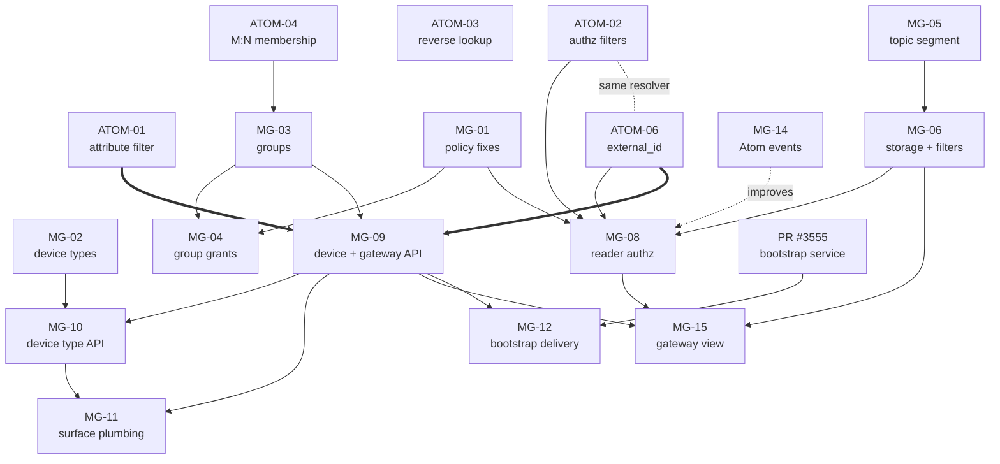

# Edge Model PRDs

Work breakdown for [../architecture.md](../architecture.md). One PRD = one PR.
Atom and Magistrala work are tracked separately because they live in different
repositories and ship independently.

These are living documents — refine as work progresses. Update the **Status**
column here when a PRD's state changes.

## Scope — phase 1

The deliverable is the **entity model**: Device, `is_gateway`, `gateways[]`,
device types, groups and sharing of device *records*, plus `external_id` on Atom
entities.

**Messaging is untouched.** No `d` topic segment, no `device_id` on messages, no
per-device storage or filters. Topics are application-level
([spec §0](../architecture.md#0-phasing--read-this-first)).

| Track | PRDs |
|---|---|
| **Phase 1 — platform** | ATOM-01, ATOM-03, ATOM-04, ATOM-06 · MG-01, MG-03, MG-04, MG-08 *(part A)*, MG-09, MG-11 |
| **Phase 1 — UI** | UI-01, UI-02 *(panels 1–2)*, UI-03 |
| **⏸ Phase 2** | ATOM-02 · MG-02, MG-05, MG-06, MG-08 *(part B)*, MG-10, MG-12, MG-13, MG-14, MG-15 |
| **Withdrawn** | ATOM-05, MG-07 |

**UI is in scope and tracked here.** The model deliberately pushes gateway-ness to
the UI — `is_gateway` and `gateways[]` are attributes and a query filter, nothing
more — so without UI-01/02/03 "gateway" ships specified and unbuilt. They execute
in `absmach/magistrala-ui` (`apps/mg` frontend, `backend/` BFF), which is the only
layer holding both an Atom client and a reader client.

**Device types are phase 2.** MG-02 and MG-10 wire up Atom's existing profile
machinery; nothing in phase 1 needs them.

**Accepted trade:** per-device *data* sharing does not work in phase 1. A customer
can be granted a device record, but message data cannot be filtered by device —
that needs `device_id`, which is phase 2.

**Do not defer MG-08 part A.** The `publishers` query filter is applied today with
no authorization check (`readers/api/http/transport.go:251-266`), so any user who
can read a channel reads every publisher on it. It is a live defect, it needs none
of the device work, and it is phase 1.

## Build order — phase 1

```
P0   ATOM-01   ATOM-04   ATOM-06        MG-01
        │         │         │             │
P1      │       MG-03       │             ├──► MG-08 (part A)
        │         │         │             │
        │       MG-04       │             │
P4      └─────────┴──────► MG-09 ──► MG-11
                             │           │
P5                           └──► UI-01 ─┴──► UI-02
                                    └────────► UI-03 ◄── MG-04, ATOM-03
```

**Critical path:** ATOM-06 → MG-09 → MG-11 → UI-01.

**Orderings that must not be swapped:**
- **ATOM-01 before MG-09** — the gateway→devices reverse lookup is an
  `attributesContains` query; without it, listing a gateway's devices means
  fetching every device in the domain.
- **ATOM-03 before UI-03 claims to revoke** — with multi-group membership,
  removing a device from one group does not necessarily end access. Without the
  reverse lookup the UI can only honestly say "removed from this group".

*(ATOM-02/ATOM-06 resolver conflict returns in phase 2, when ATOM-02 lands.)*

## Repositories

| Prefix   | Repo                 | Language |
| -------- | -------------------- | -------- |
| `ATOM-*` | `absmach/atom`       | Rust     |
| `MG-*`   | `absmach/magistrala` | Go       |

## Priority order

### P0 — Correctness foundations

Nothing else is safe to build on until these land. Two are pure parameter
plumbing in Atom; one fixes defects that the new access model would otherwise
inherit.

| PRD                                                   | Repo | Title                                                   | Depends on | Status |
| ----------------------------------------------------- | ---- | ------------------------------------------------------- | ---------- | ------ |
| [ATOM-01](./ATOM-01-entity-attribute-filter.md)       | Atom | Expose `attributesContains` on entity and group queries | —          | Draft  |
| [ATOM-02](./ATOM-02-authorized-object-ids-filters.md) | Atom | Expose scoping filters on `authorizedObjectIds`         | —          | Draft  |
| [ATOM-04](./ATOM-04-many-to-many-group-membership.md) | Atom | Many-to-many object group membership                    | —          | Draft  |
| [ATOM-06](./ATOM-06-entity-external-id.md)            | Atom | Entity `external_id`, unique per tenant                 | —          | Draft  |
| [MG-01](./MG-01-atom-policy-device-fixes.md)          | MG   | Fix Atom policy device defects                          | —          | Draft  |

ATOM-04 is the largest of the Atom items and the only one touching the
authorization evaluation path. ATOM-01 and ATOM-02 are parameter plumbing —
ATOM-01 backs the gateway→devices reverse lookup and is **required**, not
optional. ATOM-05 and ATOM-06 are permissive migrations.

**ATOM-05 is withdrawn.** Gateway is a capability (`is_gateway`), not an entity
kind — see [spec §8 A12](../architecture.md#8-decision-record). That removes an
Atom migration and the silent trap it carried, where a new kind would have
stripped every gateway's right to publish.

### P1 — Device model in the Atom client

Magistrala's Go client exposes a small subset of what Atom supports. These add
the primitives the model needs. All three are additive.

| PRD                                     | Repo | Title                                       | Depends on   | Status |
| --------------------------------------- | ---- | ------------------------------------------- | ------------ | ------ |
| [MG-02](./MG-02-device-type-api.md)     | MG   | Device Type (Atom Profile) API              | —            | Draft  |
| [MG-03](./MG-03-group-device.md)        | MG   | Group membership, hierarchy and group kinds | ATOM-04      | Draft  |
| [MG-04](./MG-04-group-scoped-grants.md) | MG   | Group-scoped permission blocks              | MG-01, MG-03 | Draft  |
| [MG-14](./MG-14-atom-event-consumer.md) | MG   | Consume Atom domain events                  | —            | Draft  |

MG-14 is independent of the rest of P1 and can start immediately. MG-08 ships
TTL-only without it, so land it first if you want its authorized-set cache
event-invalidated rather than retrofitted. (Its other original consumer, MG-07's
attachment cache, no longer exists.)

### P2 — Message attribution

Splits "who sent it" from "whose data it is". The core new capability.

| PRD                                                | Repo | Title                                         | Depends on | Status |
| -------------------------------------------------- | ---- | --------------------------------------------- | ---------- | ------ |
| [MG-05](./MG-05-topic-device-segment.md)           | MG   | Topic grammar: device segment and `device_id` | —          | Draft  |
| [MG-06](./MG-06-device-id-storage-filters.md)      | MG   | Persist and filter `device_id`                | MG-05      | Draft  |
| ~~[MG-07](./MG-07-gateway-attachment-enforcement.md)~~ | MG | ~~Gateway publish-on-behalf-of enforcement~~ | — | **Withdrawn** |

MG-07 is withdrawn: the `gateway_id` attachment it enforced no longer exists, and
the channel is now the publish boundary ([spec §8 A7](../architecture.md#8-decision-record)).
That removes the attachment cache and its invalidation entirely.

### P3 — Access enforcement

Closes a live security hole. See [architecture.md §5.6](../architecture.md#the-security-fix-is-not-optional).

| PRD                                           | Repo | Title                                              | Depends on            | Status |
| --------------------------------------------- | ---- | -------------------------------------------------- | --------------------- | ------ |
| [MG-08](./MG-08-reader-authorization.md)      | MG   | Reader authorization: enforce per-device access    | MG-01, MG-06, ATOM-02, ATOM-06 | Draft |
| [ATOM-03](./ATOM-03-reverse-policy-lookup.md) | Atom | Reverse policy lookup: `directPolicies(objectId:)` | —                     | Draft  |

### P4 — API surface

The breaking rename. Clean break — `Client` is removed, not aliased.

| PRD                                    | Repo | Title                                    | Depends on   | Status |
| -------------------------------------- | ---- | ---------------------------------------- | ------------ | ------ |
| [MG-09](./MG-09-device-gateway-api.md) | MG   | Device, Gateway and the reachability relation | MG-03, ATOM-01, ATOM-06 | Draft |
| [MG-10](./MG-10-device-type-api.md)    | MG   | Device Type API surface                  | MG-02, MG-09 | Draft  |
| [MG-11](./MG-11-surface-plumbing.md)   | MG   | CLI, PAT scopes, permissions, OpenAPI    | MG-09, MG-10 | Draft  |
| [MG-15](./MG-15-gateway-device-view.md) | MG  | Gateway device view — declared ∪ observed | MG-06, MG-08, MG-09 | Draft |

MG-15 sits here rather than with the other access work because it needs MG-09's
relation. **It must not ship before MG-08:** without the authorized-set
narrowing, a gateway roster leaks every device a gateway serves to anyone with
channel read.

No separate `gateways` PAT scope or permission block — a gateway is a device.
`/gateways` is a filtered view, not a distinct resource.

### Withdrawn

| PRD | Why |
|---|---|
| [ATOM-05](./ATOM-05-gateway-entity-kind.md) | Gateway is a capability, not an entity kind (spec §8 A12) |
| [MG-07](./MG-07-gateway-attachment-enforcement.md) | The `gateway_id` attachment it enforced no longer exists; the channel is the publish boundary (A7) |

### P5 — Bootstrap delivery

Back in scope as of [spec §8 A13](../architecture.md#8-decision-record): the cloud
holds the serial → bus-address map, so bootstrap is the mechanism that delivers it.
Requires PR #3555 merged and rebased onto `pkg/atom`.

| PRD                                           | Repo | Title                                                 | Depends on   | Status |
| --------------------------------------------- | ---- | ----------------------------------------------------- | ------------ | ------ |
| [MG-12](./MG-12-bootstrap-device-bindings.md) | MG   | Bootstrap bindings, fleet and address rendering       | #3555, MG-09 | Draft  |

### Deferred

| PRD                                             | Repo | Title                              | Status |
| ----------------------------------------------- | ---- | ---------------------------------- | ------ |
| [MG-13](./MG-13-gateway-announced-discovery.md) | MG   | Gateway-announced device discovery | Deferred |

MG-13 predates A7 and A8 and needs revising before it is picked up: late binding
removes the pending-device ingest check, and there is no attachment to re-home.
Its scenarios remain valid, and A13 makes it more attractive — agent-discovered
addresses would populate the edge automatically.

## Dependency graph



ATOM-03 has no hard dependents — it backs the "who can still see this device"
question that multi-group membership makes non-obvious. ATOM-05, MG-07 (withdrawn)
and MG-13 (deferred) are omitted.

## Parallelisation

Three tracks run concurrently and converge on MG-09:

- **Atom track** — ATOM-01, -02, -03, -04, -06 are independent *in design*.
  ATOM-04 is on the critical path for the model track, so start it first.
  ATOM-02 and ATOM-06 edit the same resolver and will conflict in the diff —
  sequence them or land them together.
- **Attribution track** — MG-05 → MG-06 → MG-08. Touches messaging and storage,
  independent of Atom except MG-08's dependency on ATOM-02 and ATOM-06.
- **Model track** — MG-02, MG-03, MG-04 touch only `pkg/atom`. MG-02 is
  independent; MG-03 waits on ATOM-04.
- **MG-14** is gated on nothing and can start immediately.

MG-09 has the widest blast radius and should not start until the model track is
settled, since it freezes the public API shape. MG-12 is last — it needs both
MG-09 and PR #3555 rebased onto `pkg/atom`.

## Decisions

The spec is [../architecture.md](../architecture.md) — a single source of truth.
Its **§11 Decision record** holds every question, the options weighed, the ruling
and its consequences. Sections 1–10 are normative; §11 is the rationale.

All code-blocking questions are resolved. Several 🟡 items still gate individual
PRDs and are named in each PRD's Risks section.

## Conventions used in these PRDs

- **Scope** sections are binding. Anything under "Out of scope" belongs to
  another PRD; if it turns out to be unavoidable, amend both PRDs rather than
  widening silently.
- File references are `path:line` against `main` at the time of writing
  (`e8cf13c7f` for Magistrala). Verify before editing — lines drift.
- Every PRD states acceptance criteria as observable behaviour, not as
  "code written".
